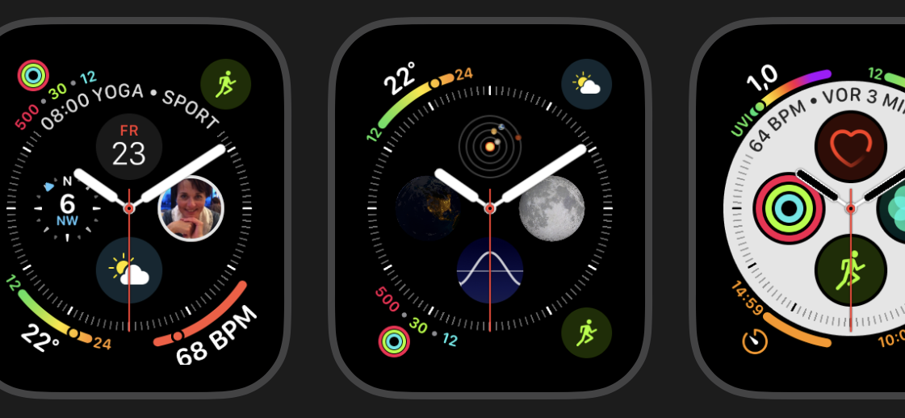

# Guenter's Real-World Artificial Intelligence Diary  
#### About bioinformatics / genomics / omics and machine learning / deep learning -- or no (human) intelligence in software  
Other than that:  


Actually I prefer ballroom dancing, not really dressed up, but still...  
And I like to run after balls for the life of me, mainly in soccer / football, (beach) volleyball. Too short for basketball.

## Apple Watch 4 Infograph (Modular) Watchfaces / Zifferblätter
2018-11-22 - 2018-11-23 (to be continued and updated)  
Apple makes a big deal about the Watch 4's bigger screen and how the Infograph watchfaces take advantage of it with no less than eight complications. Having grown totally immune to over-hyped details with little to no usefulness, I must emphasize that I'm impressed.

There is one detail though that hurts the connoisseur's eye:
While shapes are beautifully crafted, fitting the overall expectance of coolness in Apple design, the overall colorfulness and the multitude of non-matching colors is a real bummer.

The only solution for the sensible would be to theme the colors, but I guess we won't see that soon and from experience I know that the bulk of the people won't recognize the sorry state at all.

The Infographs' current coloring totally reminds me of the early nineties, where absolutely tasteless desktop-publishing amateurs thought they need to show off every single font (in the hundreds) and face that Corel Draw offered. That could only be outdone by the ugliness of Word-Art.

When I came across such a specimen / leaflet I used to ask people if they had a gripe with the design and almost nobody (except the professional from the print shop and my illustrator friend) saw it / was offended.

I still love the Infographs' eye-catching eye-candy looks and how they max out functionality and display real-estate!



## Smart Watch Use Cases in 2017 and Beyond
### Apple Watch - Wo ich sie nicht mehr missen möchte
The Watch helps the old brain get up to speed again with music titles and their artists, ancient and new. (There used to be a time where I *knew* this. Long gone. New info occupying that space.)  
In that respect I appreciate the new BMW's FM RDS displaying this info. How many times did I pledge to look up the great new song that's been playing on the radio, but almost always forgot then. Maybe I need the Apple Watch's dictation function to make this really work.

2018-06: The **Digital Crown** comes in handy to adjust the volume for the totally wireless and tiny Sony WF-1000X in-ears (no good fit for *my* ears) that don't have such a control.  
Even for the Sony WH-1000XM2 on-ears (highly recommended for their sound and active noise cancelling) I rather use the crown than the touchpad, because the latter might mis-interpret a gesture while the crown will not and I have finer control and feedback of the volume.
### Huawei Watch 2
2018-05: I bought a Huawei Watch 2, because I wanted a Google Wear OS device that I can do programming trials with.  
While I generally like the Huawei Watch 2 and Wear OS, the heart-rate-sensor is trash and I rely on the one on the Apple Watch.

2018-11: Wear OS 2.1 looks promising with its new structure and focus on Google Assistant and Activities. (swipe to the right and left respectively)  
But in praxis it was outdone by WatchOS 5 the first day.  
I had passed on and updated the Apple Watch Series 2. When we took a walk I showed how to trigger the walk workout on manually, as I was used to. After a couple of minutes my Series 4 asked if I was having a walk. Nice.

This is not to say I'll rely on the auto-detect any time soon. First need to gain experience how good the auto-trigger is or gets -- and how much and how fast it learns. Guess everybody tends to forget to trigger and it was another pleasant surprise to see the Watch ask after the walk when I drove off in the car.

## 2018-05-04 Adeept and SunFounder Car Kits - Part 1: Tips and Tweaks
This is about my venture into lane-detecting and ultimately self-driving model cars, starting with simple [improvements to the SunFounder software available in the respective repository](https://github.com/ai-bits/SunFounder-improved).

### The Story
Already end of November 2017 I got to know that our JKU Bioinformatics institute (genomics, but with a heavy AI-focus - so also self-driving cars) had got a 1:8 model car from a big German car manufacturer, left-over from their 2017 competition, good for marketing purposes and possibly to get our toes wet in autonomous driving.

Sadly it took until (after) "Lange Nacht der Forschung" mid April 2018 for some activity and access, so I decided to roll my own for a head-start during the Easter holidays.

### Traxxas Ford F-150 with Nvidia Jetson TX2
Actually I wanted to use 1:10 scale for self-driving experiments, so I bought a Traxxas Ford F-150 Raptor, pretty similar to the chassis used in MIT and other examples. I want to equip it with the Nvidia Jetson TX2 I've been owning.  
When I dove into the details, it turned out in the projects they had even replaced the few standard car parts, e.g. the motor controller with a Vedder one, where I feared I couldn't get my hands on. (quickly or inexpensively)

### Adeept w/ Arduino & SunFounder w/ Pi 3B
To get up to speed and try out variants (e.g. how to get the Pulse Width Modulation for control) I decided to treat myself to two small cars:
- an Adeept Intelligent Remote Control Car Kit, where the PWM-signal is directly realized via the Arduino's ports. As an aside I found the remote control via Arduino Nanos very intriguing.
- a SunFounder Smart Video Car for Raspberry Pi with a PCA9685-based servo controller and a USB camera.

### SunFounder HW Tweak for Pi HDMI Access
The hardware of both brands is quite nice, but for the SunFounder I'd wished they had put the Pi on a different level (higher) relative to the other boards (all with 12 mm standoffs) to make the Pi's HDMI accessible when remote access doesn't work.

*It's always the same: What can go wrong, goes wrong.*  
I had the Pi assigned a static IP on the Huawei router, but it didn't take long that I couldn't get to it via VNC. One would think it was a piece of cake to list the IP-leases on the router, but either I'm blind or it isn't obvious.  
(Hindsight: There is no details page for connected devices, but you need to fiddly hover over the item to see the assigned IP.)
As I was planning to use the Pi on the university WLAN without an extra router or access to the IP-lease I decided to unscrew it, remove the standoffs and attach it at the right height with velcro.  
Turned out the router had forgotten the IP of exactly this device out of 14 other gadgets entered there to facilitate access through VNC when the DNS doesn't work! (as usual)

Also, the SunFounder sorely lacks an on / off switch, so I put a mini-plug between battery plus and the DC / DC converter.

### Adeept vs. SunFounder Docs - Bad vs. Good English
Documentation-wise the Adeept site has a "PDF Format" button top right as if one could get instructions this way, but it just stores the page in PDF locally.  
Now who would need this?  
The button-label actually says that, but with the relatively poor English of the page they could have meant all sorts of things.   
The **complete** assembly PDF is hidden in a zip ([Tutorials Link](https://www.adrive.com/public/vJjVc4/AdeeptIntelligentRemoteControlCarKitForArduinoV1_2.zip)) way below on the page.

One often has to look very hard and carefully how to fit parts. E.g. the front bumper and the rest of the chassis are held together with some plate on top of the other two. This is really hard to get from the murky picture.

The SunFounder docs sound like native speaker English, while the Adeept ones don't and often use expressions that don't exactly fit. Only two examples out of a lot:
- sticker instead of stick (on the remote)
- self-prepared instead of self-supplied parts

### Software Quality Problems
So far I didn't check the Adeept software very much as I mostly bought the car for its Arduino platform and interesting RC based on Nanos.

What immediately caught my eye in the AdeeptRemoteControl.ino:
```C
if(mode==0){ // Apparently there are exactly two modes
  digitalWrite(led2Pin,HIGH);
  digitalWrite(led3Pin,LOW);
}
if(mode==1){ // Why the heck is here another if and no else?
    digitalWrite(led2Pin,LOW);
    digitalWrite(led3Pin,HIGH);
}
```
Is this the way we teach the kids programming skills?

I found immediately awkward that motor control and steering are split up between the paddles on the RC. One of the first things I will do when I find time or want to use it: Unify the control on one stick.

The SunFounder delivers implementation examples that I want for the Ford / Jetson combo: Hardware-based Pulse Width Modulation motor and servo control. Guess it won't hurt to off-load this task once the Jetson gets busy with driving.

But the software leaves a lot to be desired, with comments lacking where needed, ignored bugs (Quit function in the Client GUI), functional deficiencies and the quality of the code is not up to the pedagogical claims. For improvements see the [Github repo](https://github.com/ai-bits/SunFounder-improved).

# Github Repositories / Blogs
[2018-05-04 SunFounder Smart Video Car software improved and pimped](https://github.com/ai-bits/SunFounder-improved)
[2017-01-24 Google TensorFlow and MS CNTK on One Machine, as of 2017-01 Satisfying CNTK Prerequisite and Location Requirements](github.com/ai-bits/TF-CNTK4compile)
